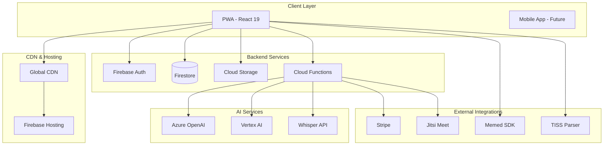
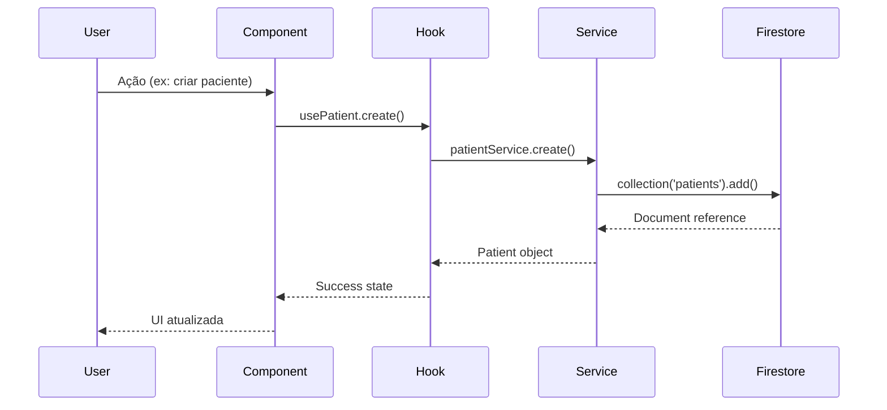
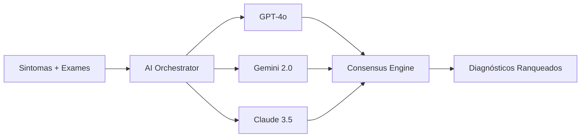
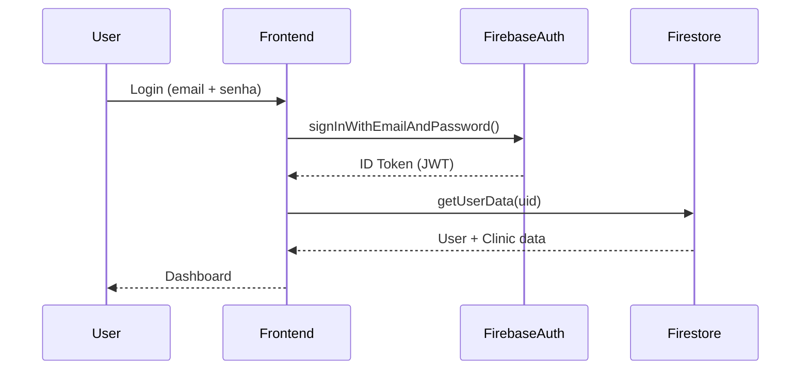

# 🏗 Genesis - Technical Architecture

> **Documentação completa da arquitetura técnica para desenvolvedores**

---

## 1. Visão Geral

### Arquitetura High-Level



### Princípios Arquiteturais

1. **Serverless-First**: Zero infraestrutura para gerenciar
2. **Edge Computing**: CDN global para baixa latência
3. **Microservices**: Funções isoladas e escaláveis
4. **Event-Driven**: Firestore triggers para automação
5. **Offline-First**: PWA com cache e sincronização

---

## 2. Frontend Architecture

### Stack

| Tecnologia | Versão | Propósito |
|------------|--------|-----------|
| React | 19.0.0 | UI Framework |
| TypeScript | 5.6.3 | Type Safety |
| Vite | 6.0.0 | Build Tool |
| Tailwind CSS | 4.0.0 | Styling |
| React Router | 7.0.1 | Routing |

### Estrutura de Pastas

```
src/
├── components/           # Componentes de funcionalidade
│   ├── layout/          # Sidebar, Header, Footer
│   ├── patient/         # Timeline, PatientCard, etc
│   ├── ai/              # AI Scribe, Clinical Reasoning
│   ├── finance/         # Transações, Relatórios
│   └── ui/              # Utilitários (Dialog, ErrorBoundary)
│
├── design-system/       # ✨ Design System Premium
│   ├── components/      # Button, Input, Modal, Card
│   ├── ThemeContext.tsx # Tema Dark/Light
│   └── tokens.ts        # Design Tokens
│
├── contexts/            # React Contexts
│   ├── AuthContext.tsx  # Autenticação
│   ├── ClinicContext.tsx # Clínica atual
│   └── ConsentContext.tsx # LGPD
│
├── hooks/               # Custom Hooks
│   ├── useAuth.ts       # Hook de autenticação
│   ├── usePatient.ts    # Hook de pacientes
│   └── usePayment.ts    # Hook de pagamentos
│
├── pages/               # Páginas (rotas)
│   ├── Dashboard.tsx
│   ├── Patients.tsx
│   └── Schedule.tsx
│
├── services/            # Camada de serviço
│   ├── firestore/       # Firebase services
│   ├── ai/              # AI services
│   └── integrations/    # APIs externas
│
├── types/               # TypeScript types
│   ├── patient.types.ts
│   ├── appointment.types.ts
│   └── payment.types.ts
│
└── __tests__/           # Testes organizados
    ├── a11y/            # Testes de acessibilidade
    ├── components/      # Testes de componentes
    ├── design-system/   # Testes do Design System
    ├── hooks/           # Testes de hooks
    └── services/        # Testes de serviços
```

### Data Flow



### State Management

| Tipo | Solução | Uso |
|------|---------|-----|
| **Global** | React Context | Auth, Clinic, Theme |
| **Local** | useState | Form state, UI state |
| **Server** | Firebase (cache) | Pacientes, Agendamentos |
| **URL** | React Router | Query params, navigation |

### Performance Optimizations

```typescript
// 1. Code Splitting
const Dashboard = lazy(() => import('./pages/Dashboard'));

// 2. Memo para componentes pesados
const PatientTimeline = memo(({ events }) => {
  // ... render
});

// 3. Virtual Lists para grandes datasets
import { FixedSizeList } from 'react-window';

// 4. Image Optimization


// 5. PWA Cache Strategy
// - Network First para dados críticos
// - Cache First para assets estáticos
```

---

## 3. Backend Architecture

### Firebase Services

#### 3.1 Firestore (Database)

**Data Model**:

```
root/
├── clinics/                    # Clínicas
│   └── {clinicId}/
│       ├── name
│       ├── settings
│       └── members[]
│
├── users/                      # Usuários
│   └── {userId}/
│       ├── email
│       ├── role
│       └── clinicId
│
├── patients/                   # Pacientes
│   └── {patientId}/
│       ├── clinicId
│       ├── name
│       ├── cpf
│       └── appointments/       # Subcoleção
│           └── {appointmentId}
│
├── appointments/               # Agendamentos
│   └── {appointmentId}/
│       ├── patientId
│       ├── professionalId
│       ├── date
│       └── status
│
├── prescriptions/              # Prescrições
│   └── {prescriptionId}/
│       ├── patientId
│       ├── medications[]
│       └── memedId
│
└── transactions/               # Transações Financeiras
    └── {transactionId}/
        ├── clinicId
        ├── amount
        ├── type
        └── status
```

**Security Rules**:

```javascript
rules_version = '2';
service cloud.firestore {
  match /databases/{database}/documents {
    
    // Helper functions
    function isAuthenticated() {
      return request.auth != null;
    }
    
    function isClinicMember(clinicId) {
      return isAuthenticated() && 
             get(/databases/$(database)/documents/users/$(request.auth.uid)).data.clinicId == clinicId;
    }
    
    // Rules
    match /patients/{patientId} {
      allow read: if isClinicMember(resource.data.clinicId);
      allow write: if isClinicMember(request.resource.data.clinicId);
    }
    
    match /appointments/{appointmentId} {
      allow read: if isClinicMember(resource.data.clinicId);
      allow write: if isClinicMember(request.resource.data.clinicId);
    }
  }
}
```

**Indexing Strategy**:

```javascript
// Indexes para queries frequentes
patients: [
  { fields: ['clinicId', 'name'], order: 'asc' },
  { fields: ['clinicId', 'createdAt'], order: 'desc' }
]

appointments: [
  { fields: ['clinicId', 'date'], order: 'asc' },
  { fields: ['professionalId', 'date'], order: 'asc' },
  { fields: ['patientId', 'date'], order: 'desc' }
]
```

#### 3.2 Cloud Functions

**Estrutura**:

```
functions/
├── src/
│   ├── ai/
│   │   ├── scribe.ts              # AI Scribe
│   │   ├── diagnosis.ts           # Diagnóstico Assistido
│   │   └── lab-analysis.ts        # Análise de Exames
│   │
│   ├── stripe/
│   │   └── webhook.ts             # Webhook Stripe
│   │
│   ├── tiss/
│   │   ├── validator.ts           # Validação TISS
│   │   └── generator.ts           # Geração de guias
│   │
│   └── triggers/
│       ├── onAppointmentCreate.ts # Triggers automáticos
│       └── onPatientDelete.ts     # LGPD compliance
│
└── package.json
```

**Exemplo de Cloud Function**:

```typescript
import * as functions from 'firebase-functions';
import { OpenAIService } from './services/openai';

export const generateSoapNote = functions
  .region('southamerica-east1')
  .https.onCall(async (data, context) => {
    // 1. Validação
    if (!context.auth) {
      throw new functions.https.HttpsError(
        'unauthenticated',
        'User must be authenticated'
      );
    }

    // 2. Extração de dados
    const { transcription, patientContext } = data;

    // 3. Chamada para OpenAI
    const soapNote = await OpenAIService.generateSOAP({
      transcription,
      patientContext,
    });

    // 4. Salvar no Firestore
    await firestore.collection('soap_notes').add({
      userId: context.auth.uid,
      ...soapNote,
      createdAt: FieldValue.serverTimestamp(),
    });

    return soapNote;
  });
```

**Triggers Automáticos**:

```typescript
// Trigger quando paciente é deletado (LGPD)
export const onPatientDelete = functions
  .firestore
  .document('patients/{patientId}')
  .onDelete(async (snapshot, context) => {
    const patientId = context.params.patientId;
    
    // Deletar dados relacionados
    const batch = firestore.batch();
    
    // Appointments
    const appointments = await firestore
      .collection('appointments')
      .where('patientId', '==', patientId)
      .get();
    
    appointments.forEach(doc => batch.delete(doc.ref));
    
    // Prescriptions
    const prescriptions = await firestore
      .collection('prescriptions')
      .where('patientId', '==', patientId)
      .get();
    
    prescriptions.forEach(doc => batch.delete(doc.ref));
    
    await batch.commit();
  });
```

#### 3.3 Cloud Storage

**Estrutura de Buckets**:

```
storage/
├── avatars/                    # Fotos de perfil
│   └── {userId}.jpg
│
├── patient-documents/          # Documentos de pacientes
│   └── {clinicId}/
│       └── {patientId}/
│           ├── exams/
│           │   └── {examId}.pdf
│           └── images/
│               └── {imageId}.jpg
│
└── prescriptions/              # Prescrições geradas
    └── {clinicId}/
        └── {prescriptionId}.pdf
```

**Security Rules**:

```javascript
rules_version = '2';
service firebase.storage {
  match /b/{bucket}/o {
    
    match /avatars/{userId} {
      allow read: if request.auth != null;
      allow write: if request.auth.uid == userId;
    }
    
    match /patient-documents/{clinicId}/{patientId}/{allPaths=**} {
      allow read, write: if request.auth != null && 
                           isClinicMember(clinicId);
    }
  }
}
```

---

## 4. AI Architecture

### Multi-LLM Strategy



### AI Services

#### 4.1 AI Scribe (Transcrição)

```typescript
// Pipeline de transcrição
Audio → Whisper API → GPT-4o (estruturação) → SOAP Note

// Exemplo de implementação
async function transcribeConsultation(audioBlob: Blob): Promise<SOAPNote> {
  // 1. Transcrever áudio
  const transcription = await whisper.transcribe(audioBlob, {
    language: 'pt',
    model: 'whisper-1',
  });
  
  // 2. Estruturar em SOAP
  const soapNote = await openai.chat.completions.create({
    model: 'gpt-4o',
    messages: [
      {
        role: 'system',
        content: SOAP_STRUCTURE_PROMPT,
      },
      {
        role: 'user',
        content: transcription.text,
      },
    ],
  });
  
  return parseSoapNote(soapNote.choices[0].message.content);
}
```

#### 4.2 Clinical Reasoning (Diagnóstico)

```typescript
// Multi-LLM consensus
async function getDifferentialDiagnosis(symptoms: string[]): Promise<Diagnosis[]> {
  const [gpt4Result, geminiResult, claudeResult] = await Promise.all([
    openai.generateDiagnosis(symptoms),
    vertex.generateDiagnosis(symptoms),
    anthropic.generateDiagnosis(symptoms),
  ]);
  
  // Consensus ranking
  return consensusEngine.rank([gpt4Result, geminiResult, claudeResult]);
}
```

#### 4.3 Lab Analysis (Análise de Exames)

```typescript
// Pipeline de análise
PDF/Image → GPT-4o Vision → Structured Data → Interpretation

// Exemplo
async function analyzeLabReport(file: File): Promise<LabAnalysis> {
  // 1. Converter para base64
  const base64 = await fileToBase64(file);
  
  // 2. Enviar para GPT-4o Vision
  const analysis = await openai.chat.completions.create({
    model: 'gpt-4o',
    messages: [
      {
        role: 'user',
        content: [
          { type: 'text', text: LAB_ANALYSIS_PROMPT },
          { type: 'image_url', image_url: { url: `data:image/jpeg;base64,${base64}` } },
        ],
      },
    ],
  });
  
  return parseLabAnalysis(analysis.choices[0].message.content);
}
```

### Rate Limiting & Cost Control

```typescript
// Estratégias para controlar custos de AI
const AI_LIMITS = {
  scribe: {
    maxMinutesPerDay: 120,
    maxRequestsPerMinute: 5,
  },
  diagnosis: {
    maxRequestsPerDay: 100,
    maxRequestsPerMinute: 2,
  },
};

// Implementação com Redis (ou Firestore)
async function checkRateLimit(userId: string, service: string): Promise<boolean> {
  const key = `rate_limit:${service}:${userId}:${getToday()}`;
  const current = await redis.incr(key);
  
  if (current === 1) {
    await redis.expire(key, 86400); // 24h
  }
  
  return current <= AI_LIMITS[service].maxRequestsPerDay;
}
```

---

## 5. Integrations Architecture

### 5.1 Telemedicine (Jitsi Meet)

```typescript
// Configuração Jitsi
const jitsiConfig = {
  domain: 'meet.jit.si',
  options: {
    roomName: `genesis_${appointmentId}`,
    width: '100%',
    height: '100%',
    parentNode: document.getElementById('jitsi-container'),
    configOverwrite: {
      startWithAudioMuted: false,
      startWithVideoMuted: false,
      enableWelcomePage: false,
      prejoinPageEnabled: false,
    },
    interfaceConfigOverwrite: {
      TOOLBAR_BUTTONS: [
        'microphone',
        'camera',
        'closedcaptions',
        'desktop',
        'fullscreen',
        'hangup',
        'chat',
        'recording',
      ],
    },
    jwt: generateJWT(userId, appointmentId), // Auth token
  },
};

// Recording to Cloud Storage
api.addEventListener('recordingStatusChanged', (event) => {
  if (event.on) {
    // Salvar recording no Firebase Storage
    saveRecordingMetadata(appointmentId, event.recordingUrl);
  }
});
```

### 5.2 Payments (Stripe)

```typescript
// Webhook Handler
export const stripeWebhook = functions.https.onRequest(async (req, res) => {
  const sig = req.headers['stripe-signature'];
  
  let event;
  try {
    event = stripe.webhooks.constructEvent(req.rawBody, sig, webhookSecret);
  } catch (err) {
    res.status(400).send(`Webhook Error: ${err.message}`);
    return;
  }
  
  switch (event.type) {
    case 'payment_intent.succeeded':
      await handlePaymentSuccess(event.data.object);
      break;
    case 'payment_intent.payment_failed':
      await handlePaymentFailure(event.data.object);
      break;
  }
  
  res.json({ received: true });
});
```

### 5.3 TISS (Faturamento)

```typescript
// Gerador de guias TISS
class TISSGenerator {
  generate(appointment: Appointment, procedures: Procedure[]): TISSGuia {
    const guia = {
      cabecalho: {
        versaoPadrao: '4.02.00',
        registroANS: appointment.healthPlan.ans,
        dataEmissao: new Date().toISOString(),
      },
      dadosBeneficiario: {
        nome: appointment.patient.name,
        carteirinha: appointment.patient.healthPlanCard,
        cpf: appointment.patient.cpf,
      },
      dadosPrestador: {
        nome: appointment.professional.name,
        cpf: appointment.professional.cpf,
        conselho: appointment.professional.council,
        numeroConselho: appointment.professional.councilNumber,
      },
      procedimentos: procedures.map(p => ({
        codigo: p.tissCode,
        descricao: p.description,
        quantidade: p.quantity,
        valorUnitario: p.value,
      })),
    };
    
    // Validar contra XSD
    this.validate(guia);
    
    return guia;
  }
  
  validate(guia: TISSGuia): void {
    // Validação contra schema XSD ANS
    const errors = xsdValidator.validate(guia, TISS_SCHEMA);
    if (errors.length > 0) {
      throw new Error(`TISS validation errors: ${JSON.stringify(errors)}`);
    }
  }
}
```

---

## 6. Security Architecture

### Authentication Flow



### Authorization (RBAC)

```typescript
// Roles hierarchy
enum Role {
  ADMIN = 'admin',           // Todos os acessos
  DOCTOR = 'doctor',         // Acesso clínico completo
  RECEPTIONIST = 'receptionist', // Agenda + pacientes
  FINANCIAL = 'financial',   // Apenas financeiro
}

// Permissions matrix
const PERMISSIONS = {
  [Role.ADMIN]: ['*'],
  [Role.DOCTOR]: [
    'patients.read',
    'patients.write',
    'appointments.read',
    'appointments.write',
    'prescriptions.write',
    'ai.use',
  ],
  [Role.RECEPTIONIST]: [
    'patients.read',
    'appointments.read',
    'appointments.write',
  ],
  [Role.FINANCIAL]: [
    'transactions.read',
    'transactions.write',
    'reports.read',
  ],
};

// Hook de autorização
function usePermission(action: string): boolean {
  const { user } = useAuth();
  const permissions = PERMISSIONS[user.role];
  
  return permissions.includes('*') || permissions.includes(action);
}
```

### Data Encryption

| Camada | Método | Descrição |
|--------|--------|-----------|
| **Transport** | TLS 1.3 | HTTPS em todas as comunicações |
| **At Rest** | AES-256 | Firebase criptografa automaticamente |
| **Application** | Opcional | Dados sensíveis podem ter criptografia adicional |

---

## 7. Monitoring & Observability

### Logs

```typescript
// Firebase Performance Monitoring
const trace = performance.trace('load_patient_timeline');
trace.start();

try {
  const timeline = await patientService.getTimeline(patientId);
  trace.stop();
  return timeline;
} catch (error) {
  trace.putAttribute('error', error.message);
  trace.stop();
  throw error;
}
```

### Error Tracking

```typescript
// Sentry integration (opcional)
import * as Sentry from '@sentry/react';

Sentry.init({
  dsn: process.env.VITE_SENTRY_DSN,
  environment: process.env.NODE_ENV,
  integrations: [
    new Sentry.BrowserTracing(),
    new Sentry.Replay(),
  ],
  tracesSampleRate: 0.1,
  replaysSessionSampleRate: 0.1,
});
```

### Metrics

| Métrica | Ferramenta | Threshold |
|---------|------------|-----------|
| **Uptime** | Firebase Hosting | 99.9% |
| **Response Time** | Firebase Performance | < 200ms (p95) |
| **Error Rate** | Sentry | < 0.1% |
| **AI Latency** | Custom logs | < 5s (p95) |

---

## 8. CI/CD Pipeline

```yaml
# .github/workflows/deploy.yml
name: Deploy to Production

on:
  push:
    branches: [main]

jobs:
  test:
    runs-on: ubuntu-latest
    steps:
      - uses: actions/checkout@v3
      - uses: actions/setup-node@v3
      - run: npm ci
      - run: npm run lint
      - run: npm run type-check
      - run: npm run test:coverage
      
  build:
    needs: test
    runs-on: ubuntu-latest
    steps:
      - uses: actions/checkout@v3
      - run: npm ci
      - run: npm run build
      
  deploy:
    needs: build
    runs-on: ubuntu-latest
    steps:
      - uses: actions/checkout@v3
      - uses: FirebaseExtended/action-hosting-deploy@v0
        with:
          repoToken: ${{ secrets.GITHUB_TOKEN }}
          firebaseServiceAccount: ${{ secrets.FIREBASE_SERVICE_ACCOUNT }}
          channelId: live
```

---

<p align="center">
  <strong>🏥 Genesis - Arquitetura Robusta e Escalável</strong>
</p>
